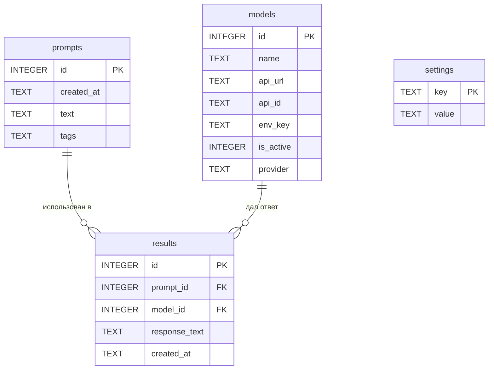

# Схема базы данных ChatList

База данных: **SQLite**, файл по умолчанию — `chatlist.db`.  
Доступ инкапсулирован в модуле `db.py` (см. [PROJECT.md](PROJECT.md)).

---

## Обзор таблиц

| Таблица | Назначение |
|---------|------------|
| `prompts` | Сохранённые запросы пользователя |
| `models` | Нейросети и параметры подключения |
| `results` | Сохранённые ответы моделей |
| `settings` | Настройки программы (ключ–значение) |

---

## ER-диаграмма



---

## Таблица `prompts`

Хранит сохранённые промты пользователя.

| Поле | Тип | Ограничения | Описание |
|------|-----|-------------|----------|
| `id` | INTEGER | PRIMARY KEY AUTOINCREMENT | Уникальный идентификатор |
| `created_at` | TEXT | NOT NULL, DEFAULT `datetime('now')` | Дата и время создания (ISO 8601) |
| `text` | TEXT | NOT NULL | Текст промта |
| `tags` | TEXT | DEFAULT `''` | Теги через запятую, например: `python, api, refactor` |

**Индексы:**
- `idx_prompts_created_at` — сортировка по дате;
- `idx_prompts_tags` — опционально, для поиска по тегам.

```sql
CREATE TABLE prompts (
    id         INTEGER PRIMARY KEY AUTOINCREMENT,
    created_at TEXT    NOT NULL DEFAULT (datetime('now')),
    text       TEXT    NOT NULL,
    tags       TEXT    NOT NULL DEFAULT ''
);
```

---

## Таблица `models`

Список нейросетей. API-ключи **не хранятся** в БД — только имя переменной окружения.

| Поле | Тип | Ограничения | Описание |
|------|-----|-------------|----------|
| `id` | INTEGER | PRIMARY KEY AUTOINCREMENT | Уникальный идентификатор |
| `name` | TEXT | NOT NULL UNIQUE | Отображаемое имя, например: `GPT-4o` |
| `api_url` | TEXT | NOT NULL | URL endpoint API |
| `api_id` | TEXT | NOT NULL | Идентификатор модели в API, например: `gpt-4o` |
| `env_key` | TEXT | NOT NULL | Имя переменной в `.env`, например: `OPENAI_API_KEY` |
| `is_active` | INTEGER | NOT NULL DEFAULT 1 | `1` — участвует в отправке, `0` — отключена |
| `provider` | TEXT | NOT NULL DEFAULT `'openai'` | Тип провайдера: `openai`, `deepseek`, `groq` и т.д. |

**Индексы:**
- `idx_models_is_active` — быстрый выбор активных моделей.

```sql
CREATE TABLE models (
    id        INTEGER PRIMARY KEY AUTOINCREMENT,
    name      TEXT    NOT NULL UNIQUE,
    api_url   TEXT    NOT NULL,
    api_id    TEXT    NOT NULL,
    env_key   TEXT    NOT NULL,
    is_active INTEGER NOT NULL DEFAULT 1 CHECK (is_active IN (0, 1)),
    provider  TEXT    NOT NULL DEFAULT 'openai'
);
```

**Пример строки:**

| name | api_url | api_id | env_key | is_active | provider |
|------|---------|--------|---------|-----------|----------|
| GPT-4o | https://api.openai.com/v1/chat/completions | gpt-4o | OPENAI_API_KEY | 1 | openai |

**Пример `.env`:**

```env
OPENAI_API_KEY=sk-...
DEEPSEEK_API_KEY=sk-...
GROQ_API_KEY=gsk_...
```

---

## Таблица `results`

Постоянное хранение ответов, отмеченных пользователем (`selected = True` во временной таблице UI).

| Поле | Тип | Ограничения | Описание |
|------|-----|-------------|----------|
| `id` | INTEGER | PRIMARY KEY AUTOINCREMENT | Уникальный идентификатор |
| `prompt_id` | INTEGER | FK → `prompts.id`, NULL | Связь с сохранённым промтом |
| `model_id` | INTEGER | NOT NULL, FK → `models.id` | Модель, давшая ответ |
| `response_text` | TEXT | NOT NULL | Текст ответа нейросети |
| `created_at` | TEXT | NOT NULL, DEFAULT `datetime('now')` | Дата сохранения |

**Индексы:**
- `idx_results_prompt_id`;
- `idx_results_model_id`;
- `idx_results_created_at`.

```sql
CREATE TABLE results (
    id            INTEGER PRIMARY KEY AUTOINCREMENT,
    prompt_id     INTEGER REFERENCES prompts(id) ON DELETE SET NULL,
    model_id      INTEGER NOT NULL REFERENCES models(id) ON DELETE CASCADE,
    response_text TEXT    NOT NULL,
    created_at    TEXT    NOT NULL DEFAULT (datetime('now'))
);
```

> **Примечание:** если промт не был сохранён в `prompts` до отправки, `prompt_id` может быть `NULL`. При сохранении результатов программа может сначала записать промт в `prompts`, затем связать результат.

---

## Таблица `settings`

Key-value хранилище настроек приложения.

| Поле | Тип | Ограничения | Описание |
|------|-----|-------------|----------|
| `key` | TEXT | PRIMARY KEY | Имя настройки |
| `value` | TEXT | NOT NULL DEFAULT `''` | Значение (строка; JSON при необходимости) |

```sql
CREATE TABLE settings (
    key   TEXT PRIMARY KEY,
    value TEXT NOT NULL DEFAULT ''
);
```

**Примеры записей:**

| key | value | Описание |
|-----|-------|----------|
| `db_path` | `chatlist.db` | Путь к файлу БД |
| `request_timeout` | `60` | Таймаут HTTP-запроса (сек) |
| `theme` | `light` | Тема интерфейса |
| `last_prompt_id` | `3` | ID последнего выбранного промта |

---

## Временная таблица результатов (не в SQLite)

При отправке промта программа создаёт **временную структуру в памяти** — не персистентную таблицу БД.

| Поле | Тип | Описание |
|------|-----|----------|
| `model_name` | str | Название модели |
| `model_id` | int | ID из таблицы `models` |
| `response_text` | str | Текст ответа или сообщение об ошибке |
| `selected` | bool | Чекбокс пользователя |

Жизненный цикл:
1. Создаётся после получения ответов от API.
2. Отображается в UI.
3. Строки с `selected = True` переносятся в `results`.
4. Полностью удаляется при новом промте или после сохранения.

---

## SQL инициализации

Полный скрипт создания схемы для `db.init_db()`:

```sql
CREATE TABLE IF NOT EXISTS prompts (
    id         INTEGER PRIMARY KEY AUTOINCREMENT,
    created_at TEXT    NOT NULL DEFAULT (datetime('now')),
    text       TEXT    NOT NULL,
    tags       TEXT    NOT NULL DEFAULT ''
);

CREATE TABLE IF NOT EXISTS models (
    id        INTEGER PRIMARY KEY AUTOINCREMENT,
    name      TEXT    NOT NULL UNIQUE,
    api_url   TEXT    NOT NULL,
    api_id    TEXT    NOT NULL,
    env_key   TEXT    NOT NULL,
    is_active INTEGER NOT NULL DEFAULT 1 CHECK (is_active IN (0, 1)),
    provider  TEXT    NOT NULL DEFAULT 'openai'
);

CREATE TABLE IF NOT EXISTS results (
    id            INTEGER PRIMARY KEY AUTOINCREMENT,
    prompt_id     INTEGER REFERENCES prompts(id) ON DELETE SET NULL,
    model_id      INTEGER NOT NULL REFERENCES models(id) ON DELETE CASCADE,
    response_text TEXT    NOT NULL,
    created_at    TEXT    NOT NULL DEFAULT (datetime('now'))
);

CREATE TABLE IF NOT EXISTS settings (
    key   TEXT PRIMARY KEY,
    value TEXT NOT NULL DEFAULT ''
);

CREATE INDEX IF NOT EXISTS idx_prompts_created_at ON prompts(created_at);
CREATE INDEX IF NOT EXISTS idx_models_is_active ON models(is_active);
CREATE INDEX IF NOT EXISTS idx_results_prompt_id ON results(prompt_id);
CREATE INDEX IF NOT EXISTS idx_results_model_id ON results(model_id);
CREATE INDEX IF NOT EXISTS idx_results_created_at ON results(created_at);
```

---

## Основные запросы

**Активные модели (отправка промта):**
```sql
SELECT * FROM models WHERE is_active = 1 ORDER BY name;
```

**Сохранение результата:**
```sql
INSERT INTO results (prompt_id, model_id, response_text)
VALUES (?, ?, ?);
```

**История результатов с именами модели и промта:**
```sql
SELECT
    r.id,
    r.created_at,
    m.name AS model_name,
    p.text AS prompt_text,
    r.response_text
FROM results r
JOIN models m ON m.id = r.model_id
LEFT JOIN prompts p ON p.id = r.prompt_id
ORDER BY r.created_at DESC;
```
